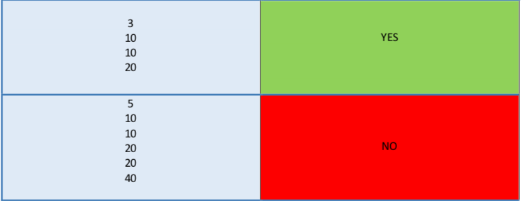

# Introduction-to-Computer-Programming

A movie has just been released and people are queuing up to buy tickets for this movie. Suppose you are a ticket counter employee and you give a ticket to a buyer in exchange for $10. Each buyer has only one 10, 20 or 40 dollar banknote. You don't have any money in the beginning and with the money you get from each buyer, you can give the rest of the money to the other buyers in the queue.

As an input, a positive integer n representing the number of people in the queue is given in the first line. Then in the next n lines, in each line there is a number from the numbers 10, 20 or 40, which represents the value of each person's banknote. 

You must declare if it is possible to sell tickets and return the rest of the buyers' money to them with this arrangement of queues. If the answer is yes, print YES, otherwise print NO.

A test case for input and output is as below:

